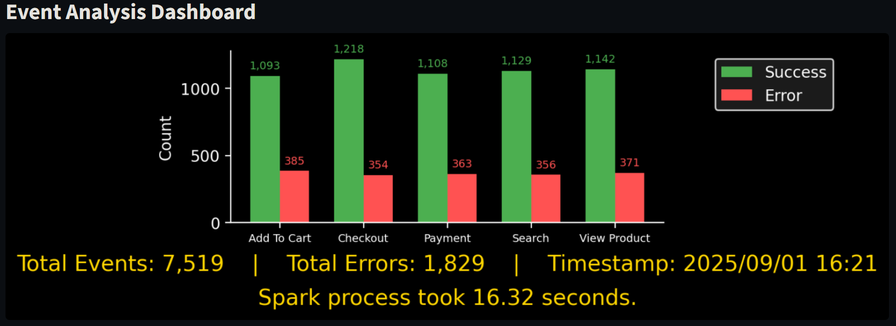
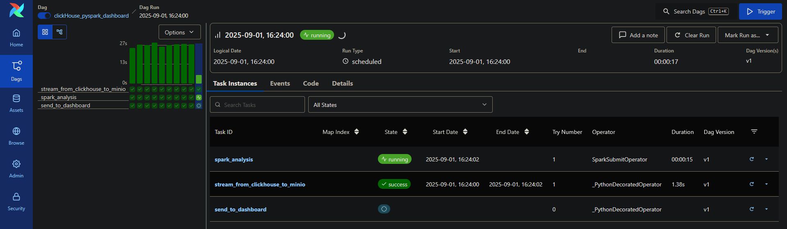

# Goal
This project demonstrates an end-to-end data pipeline that simulates, ingests, analyzes, and visualizes user interaction events in near real-time.
<br/> <br/>

# Architecture
1. **Data Simulation:** A Python script generates simplified user interaction events.
2. **Ingestion:** Events are produced to a Kafka topic using an Avro schema for data integrity.
3. **Real-time Sink:** Kafka Connect, using the official ClickHouse sink connector, streams data from Kafka into a ClickHouse database for permanent storage and fast querying.
4. **Batch Analysis:** An Airflow DAG runs every minute to:

    a. Extract the previous minute's data from ClickHouse and save it as a Parquet file in MinIO (S3-compatible object storage).
    
    b. Trigger a PySpark job to analyze the Parquet file, performing anomaly detection (calculating success/error rates for each event type).
    
    c. Push the JSON analysis result to a dashboard API.
5. **Visualization:** A Streamlit dashboard polls the API and displays the latest analysis results.

For a more detailed explanation of the components and their interactions, please see [`ARCHITECTURE.md`](./ARCHITECTURE.md).
<br/><br/>

# Component Overview
The project is broken down into several standalone services, each with a specific responsibility.

1. **Producer**:
    - Generates user interaction data.
    - Sends data to Kafka, serialized using Avro.
    - Defines the Avro schema and handles schema registration.

2. **Kafka Stack**:
    - **Kafka Broker**: Manages the real-time data stream from the producer to Kafka Connect. Runs in KRaft mode.
    - **Schema Registry**: Enforces the data contract via Avro schemas.
    - **Kafka Connect**: Streams data from the `user-interactions` topic into ClickHouse.

3. **Databases & Storage**:
    - **ClickHouse**: Stores the raw user interaction event stream..
    - **Postgres**: Serves as the metadata backend for Airflow.
    - **Redis**: Serves as the message broker for Airflow's CeleryExecutor.
    - **MinIO**: An S3-compatible object storage used to:
        - Store minutely data extracts in Parquet format for Spark.
        - Store the JSON analysis results generated by Spark.

4. **Orchestration & Processing**:
    - **Airflow**: Orchestrates the minutely batch analysis workflow (Extract -> Analyze -> Report).
    - **Spark**: Performs the batch analysis on the Parquet data stored in MinIO.
    
5. **Dashboard**:
    - **Dashboard API**: A FastAPI endpoint that receives analysis results from Airflow.
    - **Dashboard UI**: A Streamlit application that visualizes the latest analysis report.
<br/><br/>

# How to Run the Project
Ensure you have **Docker and Docker Compose**.

First, run airflow-init to create the Airflow config file:
```bash
docker compose --project-name lp --project-directory . --env-file ./env/airflow.env --env-file ./env/airflow.creds --env-file ./env/clickhouse.env --env-file ./env/clickhouse.creds --env-file ./env/kafka.env --env-file ./env/minio.env --env-file ./env/minio.creds --env-file ./env/postgres.env --env-file ./env/postgres.creds --env-file ./env/spark.env up airflow-init -d
```

Wait unitl airflow-init finishes, then run with:
```bash
docker compose --project-name lp --project-directory . --env-file ./env/airflow.env --env-file ./env/airflow.creds --env-file ./env/clickhouse.env --env-file ./env/clickhouse.creds --env-file ./env/kafka.env --env-file ./env/minio.env --env-file ./env/minio.creds --env-file ./env/postgres.env --env-file ./env/postgres.creds --env-file ./env/spark.env up -d
```

Stop it with
```bash
docker compose --project-name lp --project-directory . --env-file ./env/airflow.env --env-file ./env/airflow.creds --env-file ./env/clickhouse.env --env-file ./env/clickhouse.creds --env-file ./env/kafka.env --env-file ./env/minio.env --env-file ./env/minio.creds --env-file ./env/postgres.env --env-file ./env/postgres.creds --env-file ./env/spark.env down -v --remove-orphans
```

Then head to `localhost:8501` to see the analysis result.

## Running Tests

airflow:
```bash
docker compose --project-name test --project-directory . --env-file ./tests/env-test/airflow.env --env-file ./tests/env-test/airflow.creds --env-file ./tests/env-test/clickhouse.env --env-file ./tests/env-test/clickhouse.creds --env-file ./tests/env-test/minio.env --env-file ./tests/env-test/minio.creds --env-file ./tests/env-test/postgres.env --env-file ./tests/env-test/postgres.creds --env-file ./tests/env-test/spark.env -f tests/docker-compose.test.airflow.yml up -d
docker compose --project-name test --project-directory . --env-file ./tests/env-test/airflow.env --env-file ./tests/env-test/airflow.creds --env-file ./tests/env-test/clickhouse.env --env-file ./tests/env-test/clickhouse.creds --env-file ./tests/env-test/minio.env --env-file ./tests/env-test/minio.creds --env-file ./tests/env-test/postgres.env --env-file ./tests/env-test/postgres.creds --env-file ./tests/env-test/spark.env -f tests/docker-compose.test.airflow.yml down -v --remove-orphans
```

dashboard:
```bash
docker compose --project-name test --project-directory . -f tests/docker-compose.test.dashboard.yml up -d
docker compose --project-name test --project-directory . -f tests/docker-compose.test.dashboard.yml down -v --remove-orphans
```

db:
```bash
docker compose --project-name test --project-directory . -f tests/docker-compose.test.db.yml up -d
docker compose --project-name test --project-directory . -f tests/docker-compose.test.db.yml down -v --remove-orphans
```

producer:
```bash
docker compose --project-name test --project-directory . -f tests/docker-compose.test.producer.yml up -d
docker compose --project-name test --project-directory . -f tests/docker-compose.test.producer.yml down -v --remove-orphans
```

spark:
```bash
docker compose --project-name test --project-directory . -f tests/docker-compose.test.spark.yml up -d
docker compose --project-name test --project-directory . -f tests/docker-compose.test.spark.yml down -v --remove-orphans
```
<br/>

# Contribution Areas
There are many aspects to be further improved and features to be added:
-   Add `just` to improve commands.
-   Bake application files into Docker images instead of using volume mounts for better performance and immutable infrastructure.
-   Improve error message consistency between codes and tests.
-   Improve `command` attribute of containers by replacing hard-coded values with variables.
-   Improve `clickhouse_table_schema.sql` by replacing hard-coded values with variables (similar to `clickhouse_connector_configuration.json`).
-   Code improvements like creating a function to get ClickHouse client (similar to `get_minio_client`), so it would be cleaner and more testable.
-   Improve error handling and avoid catching exceptions blindly. 
-   Switch to `SASL_SSL` from `PLAINTEXT`.
-   Refactor shared logic (e.g., client initializations) into common utility modules to adhere to the DRY principle.
-   Simulate and handle service failures.
-   Implement a Dead-Letter Queue (DLQ) in Kafka Connect and the producer to handle malformed or problematic messages gracefully.
-   Event-Driven approach instead of REST API for reporting the analysis result.
